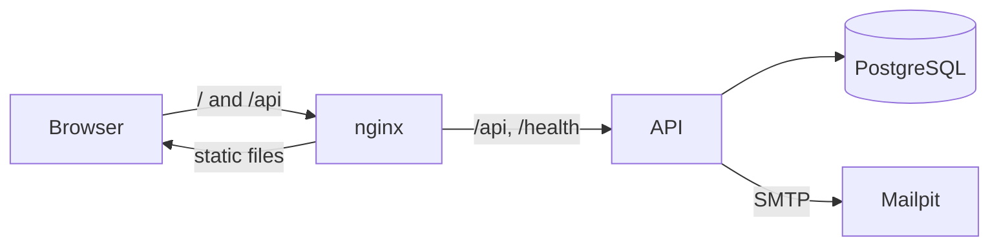

# Architecture

Who this is for: developers and reviewers who want the shape of the system before the details.
What you'll get: what the pieces are, how a request moves through them, and why the boundaries
sit where they do.

## The pieces

| Piece | What it is | Where |
| --- | --- | --- |
| Web client | React 19 and TypeScript, built by Vite, served by nginx | `frontend/` |
| API | ASP.NET Core 10, four projects | `backend/src/` |
| Database | PostgreSQL 17 | `db` container |
| Mail | Mailpit, which catches everything and delivers nothing | `mailpit` container |

The API is the product. The web client is one consumer of it, and a third party integrating
programmatically uses exactly the same documented endpoints — there is no private route the
browser gets and Postman does not.

## How a request moves

The browser only ever talks to one origin. nginx serves the built client and forwards `/api` and
`/health` to the API on the compose network; in development the Vite server forwards the same two
paths to `http://localhost:5000`. There is no cross-origin configuration anywhere, and therefore
no CORS policy to get wrong.

## Inside the API

Dependencies point inwards, and the compiler enforces it: a project cannot reference one that
would point outwards, because the reference is not there.

| Project | Knows about | Holds |
| --- | --- | --- |
| `Forum.Domain` | nothing | Entities, and the rules that must always hold |
| `Forum.Application` | Domain | Services, DTOs, and the interfaces the outer layers implement |
| `Forum.Infrastructure` | Application, Domain | Entity Framework, email, token signing |
| `Forum.Api` | all of the above | Controllers, pipeline, configuration |

Each project declares only the next one inward — `Forum.Api` references `Forum.Infrastructure` and
nothing else — and reaches the rest through it. So the second column is what a project can see, not
what its `.csproj` lists.

A request arrives, and:

1. **The controller binds and delegates.** It calls exactly one service and returns what comes
   back. There is no logic in a controller to test on its own, which is why the API tests go over
   HTTP rather than calling one directly.
2. **The service orchestrates.** It loads what it needs, calls the entity, and saves. It does not
   restate a rule the entity already holds.
3. **The entity refuses.** `Post.Like` refuses your own discussion and a second like.
   `Post.EnsureOwnedBy` refuses anybody but the author. These throw a `DomainException` carrying
   *why*, and no HTTP knowledge at all.
4. **One place turns a failure into a response.** `GlobalExceptionHandler` maps each exception to
   a status and a problem document. A new rule does not need a new `catch` in a controller.

Putting the rule on the entity means there is one place to be wrong. A service that checked
ownership itself would be a second place, and the two would eventually disagree.

## Data access

- **One query per request path.** The list and the detail share their projection, so a change to
  one cannot drift from the other.
- **Anything filtered or sorted has an index behind it.** Ordering always ends with the creation
  time and the identifier, so paging cannot repeat or skip a discussion when several share a like
  count.
- **Uniqueness is the database's job.** `SaveChangesAsync` catches PostgreSQL's `23505` and
  rethrows it as a conflict. Reading first and then writing would still let two requests through
  at the same instant; a unique index cannot.
- **Migrations are generated, never hand-written**, and never contain hand-written SQL. They are
  applied at startup, which suits one instance. A fleet would apply them as a separate step
  instead, and that is the change to make first if this ever ran on more than one node.

## Serialisation

Every payload type is listed on `ForumJsonContext`, and the source generator writes the
serialisation code at build time. `JsonSerializerIsReflectionEnabledByDefault` is off, so a type
somebody forgot to register fails immediately rather than falling back to reflection.

The cost is a line per type. The gain is that the request path uses no runtime reflection, startup
does less work, and the application stays ready for ahead-of-time compilation without a rewrite.

## Failures

Everything that goes wrong comes back as an RFC 7807 problem document, including a rejected field
and a rate-limit refusal. A caller parses one shape, never two. The full list is in
[error codes](../reference/error-codes.md).

An unexpected failure returns a fixed sentence and a trace identifier; the exception stays in the
log.

## Inside the client

- **Containers hold data; presenters take props.** A presenter can be tested with nothing but an
  object, which is why the component tests need no network.
- **Components never call the network.** A container calls a service, and the service is the only
  place that knows a URL exists.
- **State that belongs in the address bar lives there.** Filters, ordering and the page number are
  read from the query string, so a view can be shared and the back button works.
- **The session is confirmed, not trusted.** A token restored from `localStorage` is checked
  against `/auth/me` before the reader is treated as signed in.

More in [frontend conventions](frontend-conventions.md).

## Packaging

| Image | Built from | Contains |
| --- | --- | --- |
| `api` | `backend/Dockerfile` | Two stages: the SDK publishes, the ASP.NET runtime runs it as a non-root user |
| `web` | `frontend/Dockerfile` | Two stages: Node builds the bundle, nginx serves it |

Neither shipped image contains a compiler or a source file. `docker compose up` brings up the
database, the mail catcher, the API and the web client together, with the API seeding an empty
database on the way.

## What is not here

| Absent | Why |
| --- | --- |
| A mediator library | Four projects and a handful of services do not need one; see [decisions and trade-offs](decisions-and-trade-offs.md) |
| A repository layer over Entity Framework | `DbContext` is already one, and an interface over it would only make the same calls harder to read |
| A caching layer | Nothing measured is slow |
| A message queue | The one asynchronous thing is email, and it is sent inline |
| Horizontal scaling | Migrations run at startup and rate limits are held in memory, both of which assume one instance |

## Related

- [Decisions and trade-offs](decisions-and-trade-offs.md)
- [Security model](security-model.md)
- [Data model](../reference/data-model.md)
- [Engineering guidelines](../../GUIDELINES.md)
