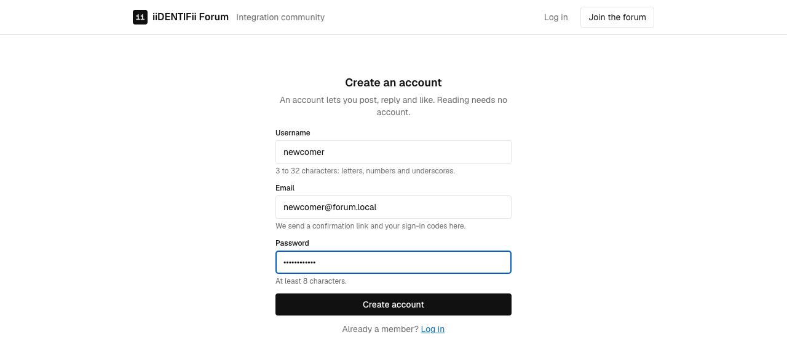
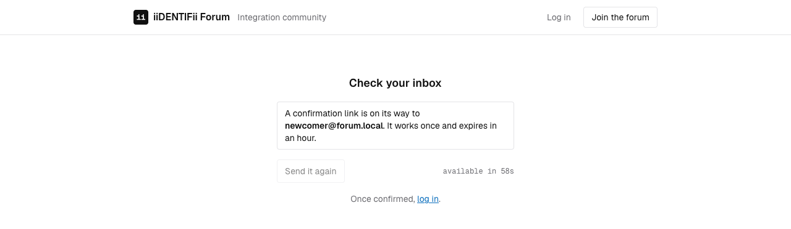
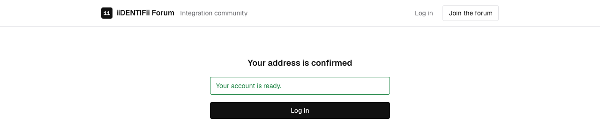

# Accounts

Who this is for: developers and testers working on registration and email confirmation.
What you'll get: how an account is created and confirmed, and why each guard is there.

## What it does

Anyone can create an account with a username, an email address and a password. The address has to
be confirmed before the account can be used, so a mistyped address costs a resend rather than an
unusable account.

Confirmation is a link, emailed once and good for an hour. Asking for another retires the previous
one, so only the newest link works.

## What it looks like

Creating an account:

After it is submitted, the reader is told where to look rather than left guessing:

Following the emailed link confirms the address:

## Endpoints

| Method | Path | Returns |
| --- | --- | --- |
| POST | `/api/v1/auth/register` | 201, and sends a confirmation link |
| POST | `/api/v1/auth/verify-email` | 200 when the link is good, 400 when it is not |
| POST | `/api/v1/auth/resend-verification` | 202, always |

## Rules

| Field | Rule |
| --- | --- |
| Username | 3 to 32 characters, letters, numbers and underscores; unique regardless of case |
| Email | A valid address, unique regardless of case |
| Password | At least 8 characters |

## Decisions worth knowing

**Uniqueness is decided by the database.** Registration inserts and lets the unique index refuse a
duplicate, rather than checking first. A check followed by an insert still lets two people claim
the same name at the same moment; the index cannot.

**Only the hash of a secret is stored.** Verification tokens, sign-in codes and reset tokens are
kept as a keyed hash, so the database alone cannot be used to forge one. The key lives in
configuration and is validated at startup, so a missing one stops the application rather than
silently weakening it.

A keyed hash is enough here, where a password needs a slow one: these secrets are long, random and
short-lived, so there is nothing worth guessing offline.

**Recovery reveals nothing about who is registered.** `resend-verification` and
`forgot-password` answer the same way whether the address belongs to an account, to a confirmed
account, or to nobody at all. The cooldown is applied silently for the same reason. Signing in is
the same: a username nobody holds and a wrong password give one message, and the hash is verified
either way so the two take about as long as each other.

**Registration is the exception, deliberately.** A duplicate address is refused with 409 rather
than accepted in silence, so somebody who already has an account is told so instead of waiting for
an email that never comes. That does let a caller test whether an address is registered, one
address at a time and inside the account rate limit. Closing it means answering 201 either way and
emailing the existing holder to say somebody tried; that is a change to what registration means,
not a correction, so it is recorded here rather than made quietly. See
[Known limitations](#known-limitations).

**Silence is in the answer, not in the timing.** The same reply either way covers what the body
says. It does not cover how long the reply takes: a known address waits for the mail server, an
unknown one returns at once, and the difference is measurable. Closing that means handing the send
to a queue instead of awaiting it in the request.

**Rate limits are configurable.** Ten requests a minute for account routes and a hundred and twenty
for everything else, both settable per deployment. A refusal carries `Retry-After`, so a caller
knows when to return rather than guessing.

**The address bar drives confirmation.** The client reads the token from the link and confirms it as
a query keyed on that token. The result therefore belongs to the token: remounting the page does
not confirm twice, and does not lose the answer.

## Known limitations

- **Registering tells a caller whether an address is already in use.** The 409 above. Rate limited,
  and traded knowingly for a signup that says what went wrong.
- **The silent recovery endpoints answer at different speeds.** The body says nothing either way;
  the time it takes does. It needs a queue to close, not a copy change.
- **Turning email off is a development affordance.** See below.

## Reading the email locally

Mailpit collects everything the forum sends, at http://localhost:8025. Register, open Mailpit, and
follow the link.

With no mail server at all, set `Email:Enabled` to `false` and the message is written to the log
instead, link included. That only happens in Development. Anywhere else the same setting logs a
warning naming the recipient and the subject, and stops there: confirmation links, reset links and
sign-in codes are exactly what a log should not carry, and silencing a broken mail server should
not be the way they get there.

## Testing it

`backend/tests/Forum.Tests/Api/RegistrationTests.cs` and `EmailVerificationTests.cs` cover
registration, the duplicates, the field rules, the single-use link, expiry, the resend cooldown,
and that nothing reveals who is registered. `RateLimitTests.cs` runs against its own host with a
deliberately low limit and checks the refusal carries `Retry-After`.

Tests advance a clock the host provides rather than waiting, so expiry and cooldowns are exercised
in milliseconds.
