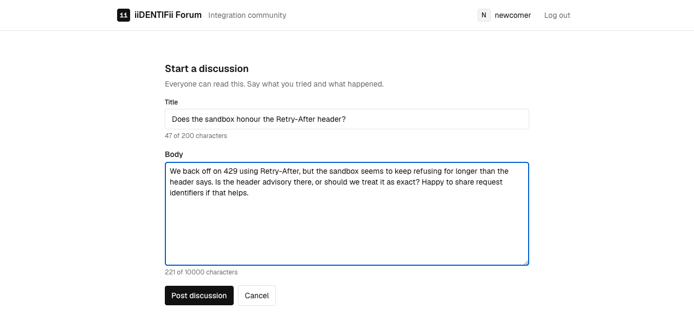
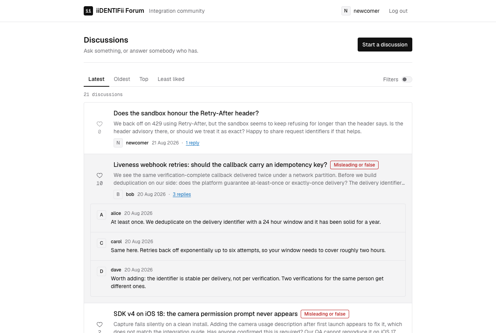
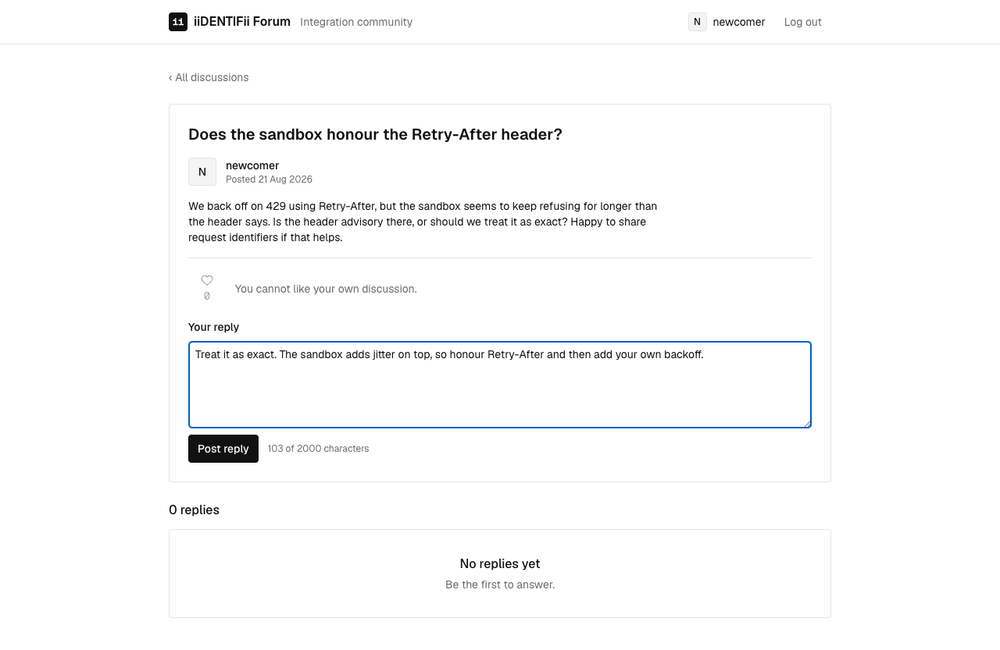

# Contributing content

Who this is for: developers and testers working on posting, replying and liking.
What you'll get: what a member can add to the forum, what is refused, and why.

## What it does

A member can start a discussion, reply to one, and like somebody else's. Reading stays open to
everyone: an anonymous visitor sees every discussion, every reply and every like count, and is
told to sign in rather than shown a control that will be refused.

Liking has two rules. Nobody likes their own discussion, and nobody likes the same one twice.

## Endpoints

| Method | Path | Who | Returns |
| --- | --- | --- | --- |
| POST | `/api/v1/posts` | member | 201 with the discussion |
| POST | `/api/v1/posts/{id}/comments` | member | 201 with the reply |
| POST | `/api/v1/posts/{id}/like` | member | 201, or 409, or 422 |
| DELETE | `/api/v1/posts/{id}/like` | member | 204, or 404 |

## Limits

| Field | Rule |
| --- | --- |
| Discussion title | 1 to 200 characters |
| Discussion body | 1 to 10,000 characters |
| Reply body | 1 to 2,000 characters |

The composer counts the same limits the API enforces, so a refusal is met while typing rather
than after a round trip. The API still enforces them, because a browser is not a trustworthy place
to keep a rule.

## Decisions worth knowing

**The rules live on the entity.** `Post.Like` refuses a self-like and a repeat like. A service
that forgot to check would still be refused, because the check is not in the service.

**The unique index is what actually decides a duplicate.** Reading the likes and then inserting
would let two requests arriving together both pass the check. The index on (`PostId`, `UserId`)
cannot, so the second insert fails and is reported as 409 rather than 500. There is a test that
fires both requests at once and asserts exactly one is created.

**A like reports back only to the person who gave it.** `likedByMe` is computed for whoever is
asking, so the same discussion reads differently for two members and shows false to nobody in
particular. The count is public; who liked it is not published.

**Replies are counted, not embedded.** A discussion carries `commentCount`, and replies are
fetched separately. The list would otherwise carry every reply of every discussion on the page.

**The list expands replies on request.** Pressing the reply count fetches the first few replies
for that discussion and shows them in place. Nothing is fetched until it is asked for, so opening
a page of twenty discussions still costs one request rather than twenty-one.

## What it looks like

Starting a discussion:

The list, with one discussion's replies expanded in place:

Replying, from the discussion itself:

## Trying it by hand

1. Sign in, then press **Start a discussion**.
2. Post it. The forum opens what you wrote.
3. Try to like it. The control is inert and says why.
4. Sign in as somebody else, like it, and the count moves.
5. Like it again through Postman: 409.
6. Press a reply count in the list. The replies appear without leaving the page.
