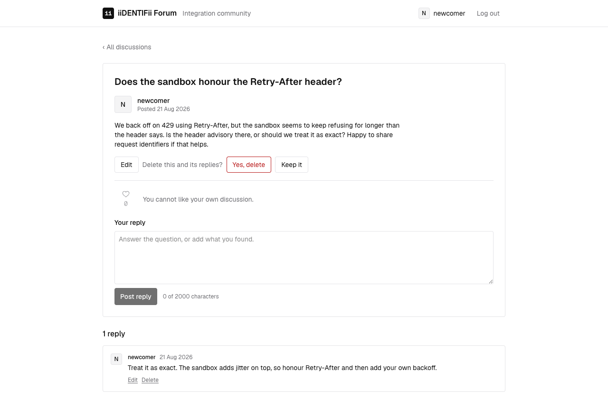

# Moderation and ownership

Who this is for: developers and testers working on flagging, editing and deleting.
What you'll get: who may change what, and how that is enforced.

## What it does

A moderator can mark a discussion as **misleading or false**. The mark is prominent, because it
exists for regulatory reasons: a reader should not be able to miss it. A moderator can take the
mark off again.

An author can correct or remove their own discussion, and their own replies. Deleting a discussion
takes its replies, likes and flags with it.

Moderating and authoring are separate. A moderator flags; a moderator does not rewrite somebody
else's words, and the API refuses them if they try.

## Endpoints

| Method | Path | Who | Returns |
| --- | --- | --- | --- |
| POST | `/api/v1/posts/{id}/tags` | moderator | 201, or 409 if already flagged |
| DELETE | `/api/v1/posts/{id}/tags/{tag}` | moderator | 204, or 404 if not flagged |
| PUT | `/api/v1/posts/{id}` | author | 200 with the discussion |
| DELETE | `/api/v1/posts/{id}` | author | 204 |
| PUT | `/api/v1/comments/{id}` | author | 200 with the reply |
| DELETE | `/api/v1/comments/{id}` | author | 204 |

Anybody else gets 403. Anybody without a session gets 401.

## Decisions worth knowing

**The role is checked by the entity, not the button.** `Post.Flag` is handed the member and
refuses one who is not a moderator. The endpoint carries a policy as well, so an unauthorised
caller is turned away before any work is done — but hiding the control in the interface is a
courtesy to the reader, never the thing that enforces the rule.

**Ownership is one method.** `EnsureOwnedBy` is called by editing and by deleting, on both
discussions and replies. There is one place to be wrong, and it is covered by tests that call the
endpoints directly as the wrong person.

**Deleting cascades in the database.** The replies, likes and flags of a deleted discussion go
because the schema says so, not because a service remembered to tidy up. A test deletes a
discussion that has all three and then asks for them.

**An edit is visible.** `updatedAt` is set when a discussion or reply is rewritten, and the
interface says "edited". A correction that leaves no trace is a different thing from a correction.

**Filtering by flag still works.** A freshly flagged discussion is found by `?tag=MisleadingOrFalse`,
which is what makes the flag useful to a moderator reviewing what has been marked.

## What it looks like

A moderator sees the flag control under the discussion:

Once flagged, every reader sees why:

An author sees edit and delete on their own discussion, and deleting asks first:

## Trying it by hand

1. Sign in as `mod` (`mod@forum.local`, `Password123!`), open a discussion, and flag it.
2. Sign out. The flag is on the discussion and in the list.
3. Filter the list by the flag; the discussion is there.
4. As `mod`, try to edit that discussion through Postman: 403.
5. As its author, edit it. The discussion says it was edited.
6. Delete it, and confirm its replies are gone with it.
