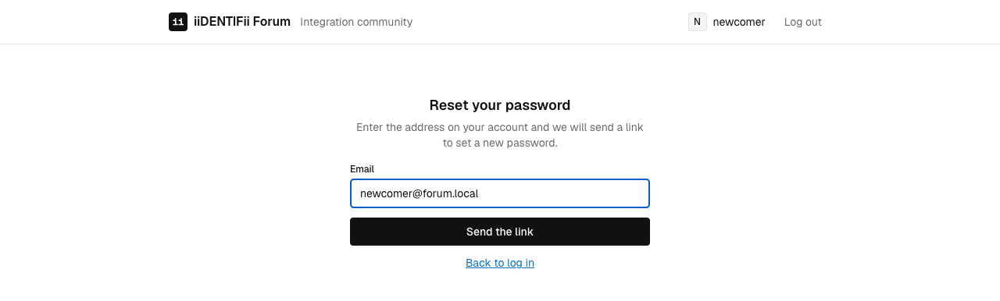
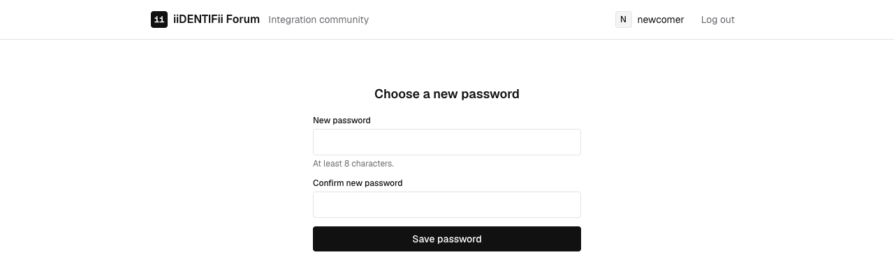

# Create an account, confirm it, and reset a forgotten password

Who this is for: anyone using the forum, and anyone testing the account journeys by hand.
What you'll get: a working account, and a password changed the way a real member would change it.

Every email the forum sends is caught by Mailpit rather than delivered, so you can complete each
journey with an address nobody owns. Mailpit is at http://localhost:8025.

Addresses below assume the containerised stack: the forum on http://localhost:8080. Running the
two applications directly puts it on http://localhost:5173 instead. Everything else is the same.

## Create an account

1. Open the forum and choose **Join the forum**.
2. Fill in the form.

   | Field | Rule |
   | --- | --- |
   | Username | 3 to 32 characters, letters, numbers and underscores |
   | Email | Any valid address; nothing is delivered anywhere |
   | Password | At least 8 characters |

   

3. Submit it. You are told to check your inbox, and offered the link again in case it went astray.

   

You cannot sign in yet. An unconfirmed account is refused at the password step, and says why.

## Confirm the address

1. Open http://localhost:8025. The message is addressed to whatever you typed.
2. Follow the link in it. The forum confirms the address and offers to sign you in.

   

The link works once and lasts an hour. Following it a second time is refused, which is what you
want from something that arrived in an inbox.

If it has expired, use **Send the link again** on the check-your-inbox page. Asking for another
link retires the previous one, so only the newest works. There is a sixty-second cooldown between
requests, applied without telling you — see below.

## Sign in

Signing in takes two steps: the password, then a six-digit code read from Mailpit. The
[tutorial](../tutorials/01-run-the-forum-and-log-in-with-2fa.md) walks the whole journey, and
[signing in](../features/signing-in.md) explains what each refusal means.

## Reset a forgotten password

1. Choose **Forgot password?** on the sign-in page.
2. Enter the address on the account.

   

3. The forum accepts it whatever you type. This is deliberate: the reply is the same for an
   address with an account and one without, so nobody can use this form to discover who is
   registered.
4. Open Mailpit and follow the link. Set the new password.

   

5. Sign in with the new password. The old one no longer works.

The reset link lasts an hour and works once. Setting a password also retires every other
outstanding link and code for that account, so a half-finished sign-in cannot be picked up
afterwards. A session token already issued is *not* revoked; the reason is in
[the security model](../explanation/security-model.md).

## When nothing arrives

| Symptom | Cause |
| --- | --- |
| Mailpit is empty after registering | The API cannot reach the mail server. Check `docker compose ps` and the API log |
| Mailpit is empty after a second request | The sixty-second cooldown. Wait, then ask again |
| The link is refused | It has expired, been used, or been retired by a newer one |
| The password step returns "confirm your email address" | The address on the account is not confirmed yet |

With no mail server at all, set `Email:Enabled` to `false` and every message is written to the API
log instead, link included. See [configuration](../reference/configuration.md).

## Testing accounts you did not create

Eleven accounts are written into an empty database on first start, already confirmed, all sharing
one published password. They are listed in [test accounts](../reference/test-accounts.md).
