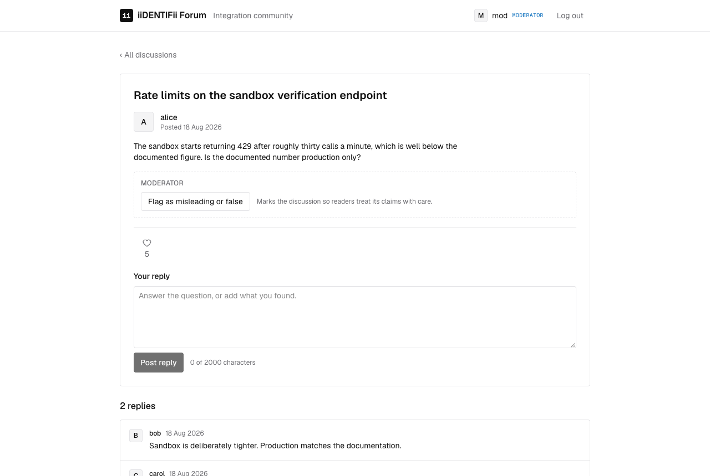
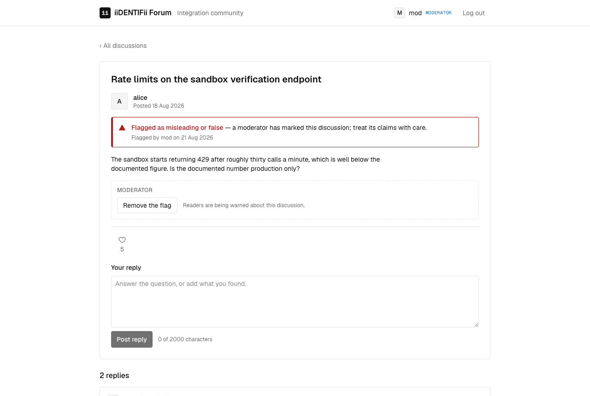

# Moderate content

Who this is for: moderators, and testers checking what a moderator can and cannot do.
What you'll get: a discussion flagged, found by the flag, and unflagged again.

A moderator marks a discussion as **misleading or false**. That is the whole of moderation here:
there is no deleting somebody else's words, no editing them, and no suspending an account.

## Sign in as a moderator

The seeded moderator is `mod`, address `mod@forum.local`, password `Password123!`. Sign in the
usual way: password, then the six-digit code read from Mailpit at http://localhost:8025.

The masthead shows **moderator** beside the name once you are in. That badge is a courtesy to the
reader; the API decides what you may do regardless of what the interface shows.

## Flag a discussion

1. Open any discussion.
2. Under it you will find the moderator control, which ordinary members do not see.

   

3. Press **Flag as misleading or false**. The flag appears immediately, and every reader sees
   it — signed in or not.

   

The flag is deliberately hard to miss. It exists for regulatory reasons, so a reader skimming
should not be able to skip past it.

Through the API, flagging the same discussion twice is refused with 409. The database holds one row
per discussion and flag, so a second attempt cannot succeed even if two moderators press at the
same moment. In the interface a single control toggles, so it cannot happen by accident.

## Find what has been flagged

Open **Filters** on the discussion list and narrow it to the moderation flag. The address bar
carries the choice, so a filtered list can be pasted to somebody else.

Directly against the API:

```bash
curl "http://localhost:5080/api/v1/posts?tag=MisleadingOrFalse&pageSize=100"
```

## Take a flag off

The same control now reads **Remove the flag**. Through the API, removing a flag that is not there
answers 404 rather than pretending to succeed.

## What a moderator cannot do

| Attempt | Answer |
| --- | --- |
| Edit somebody else's discussion | 403 |
| Delete somebody else's discussion | 403 |
| Edit or delete somebody else's reply | 403 |
| Flag as an ordinary member | 403 |

403 rather than 404 is deliberate: the discussion exists, and pretending it does not would be a
different untruth. Moderating and authoring are separate powers, and holding one does not grant
the other.

Editing and deleting your *own* content works exactly as it does for any member.

## Checking it from the API

The moderation folder of the [Postman collection](test-the-api-with-postman.md) does all of the
above in order, including each refusal, so a run proves the rules rather than the buttons.

## Related

- [Moderation and ownership](../features/moderation.md) — how it is enforced, and why
- [Endpoint reference](../reference/api-endpoints.md#moderation-and-ownership)
