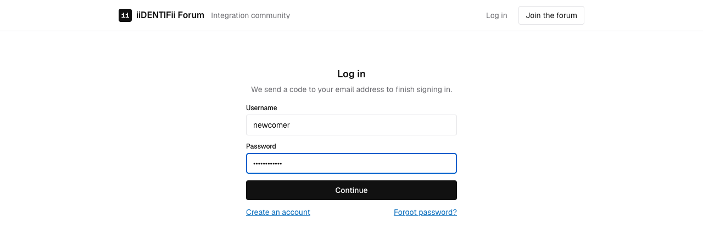
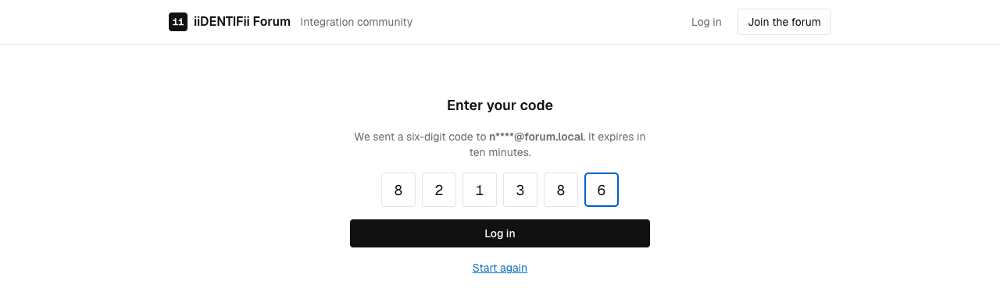
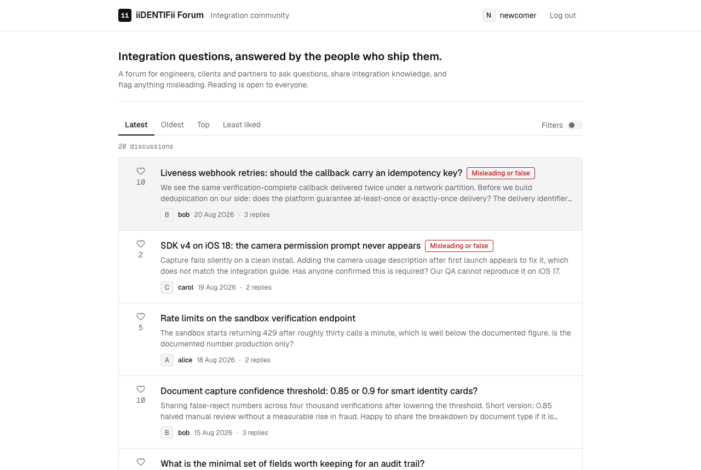

# Run the forum and log in with a one-time code

Who this is for: anyone seeing this project for the first time, including people who do not write
C# or TypeScript.
What you'll get: the whole forum running in containers, and a signed-in session obtained the way
every member obtains one — a password, then a code sent by email.

You need Docker Desktop and nothing else. The .NET SDK and Node.js are only needed if you want to
run the two applications directly; see [run it for development](../how-to/run-for-development.md)
for that.

Allow about ten minutes. Most of it is the first image build.

## 1. Start everything

From the root of the repository:

```bash
docker compose up -d --build
```

Four containers start: PostgreSQL, a mail catcher, the API and the web client. The first build
downloads the .NET and Node images and compiles both applications, so it takes a few minutes.
Later runs reuse the layers and take seconds.

Watch them come up:

```bash
docker compose ps
```

Wait until `web` reports `healthy`. That check asks the web container for `/health`, which it
forwards to the API, so a healthy `web` means the whole path works.

| Address | What it is |
| --- | --- |
| http://localhost:8080 | The forum |
| http://localhost:5080 | The API, if you want to call it directly |
| http://localhost:5080/scalar | Browsable API reference |
| http://localhost:8025 | Mailpit, holding every email the API sends |

Nothing here is published beyond your own machine: every port is bound to `127.0.0.1`.

## 2. Look around without an account

Open http://localhost:8080.

You are not signed in, and you can still read everything. Twenty discussions were written into the
database the first time the API started, with replies, likes, and three carrying a moderator's
flag.

Try these before you sign in:

- Switch the ordering between **Latest**, **Oldest**, **Top** and **Least liked**.
- Open **Filters** and narrow the list by author, by date, or by the moderation flag.
- Notice the address bar changes as you do. The list can be shared as a link.
- Open a discussion and read its replies.

The like control is there and inert, and says why when you hover it. Where the reply box would
be, there is a line inviting you to log in. Reading is open; writing is not.

## 3. Sign in as a seeded member

Click **Log in** and enter:

| Field | Value |
| --- | --- |
| Username | `alice` |
| Password | `Password123!` |



The password alone does not sign you in. The API checks it and emails a six-digit code, then the
interface asks for that code and tells you which address it went to, partly masked.



## 4. Read the code out of Mailpit

The API is configured to hand its mail to Mailpit, which catches everything and delivers nothing.
Open http://localhost:8025 and you will see the message addressed to `alice@forum.local`. It
carries a six-digit code, good for ten minutes.

Type it into the forum and you are signed in.



If you mistype it, try again — but only five times. Five wrong codes spend that sign-in attempt
outright, and you start again from the password. That limit exists because six digits is a small
enough space to walk through given enough tries.

## 5. Do something that needs an account

Now that you have a session:

1. **Like a discussion.** The count moves. On a discussion `alice` wrote, the control is inert and
   says why: nobody likes their own. The interface only explains the rule; the API is what
   enforces it.
2. **Reply.** Open a discussion, write a reply, and it appears at the end of the conversation.
3. **Start a discussion.** Signed in, the page is headed **Discussions** and carries a
   **Start a discussion** button. A new one appears at the top of the list, which is newest first.
4. **Correct it.** Your own discussion carries edit and delete. An edited discussion says so.

## 6. See what a moderator sees

Use **Log out** in the masthead, then sign in as `mod`, password `Password123!`, reading the code from
`mod@forum.local` in Mailpit. Open any discussion and you will find a control that ordinary
members do not have: marking it **misleading or false**.

Flag one, then sign out. The flag is on the discussion for every reader, and the list can be
filtered down to flagged discussions.

A moderator can flag, and only that. The interface offers `mod` no way to edit somebody else's
discussion, and asking the API directly is refused with 403 — exactly as it refuses any other
member.

## 7. Stop, and start over

Stop everything, keeping the database:

```bash
docker compose down
```

Throw the database away as well, so the next start migrates and seeds from scratch:

```bash
docker compose down -v
```

## What just happened

- Four containers, one command. The web container serves the built client and forwards `/api` to
  the API, so your browser only ever talks to one origin.
- The API applied its database migration on startup and, finding an empty database, filled it with
  sample content. It does that once: restarting never duplicates it.
- Signing in took two steps because a password on its own is not accepted anywhere in this forum.
- Every seeded account uses the same published password. That is a development affordance, and the
  API refuses to seed at all outside the Development environment.

## Where to go next

| You want to | Read |
| --- | --- |
| Call the API yourself | [Test the API with Postman](../how-to/test-the-api-with-postman.md) |
| Run the two applications without containers | [Run it for development](../how-to/run-for-development.md) |
| Understand how it is put together | [Architecture](../explanation/architecture.md) |
| Know what protects an account | [Security model](../explanation/security-model.md) |
